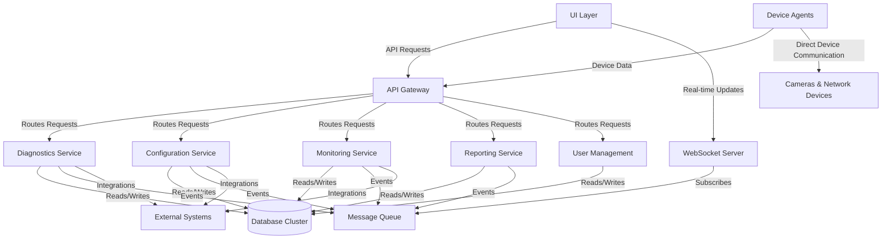
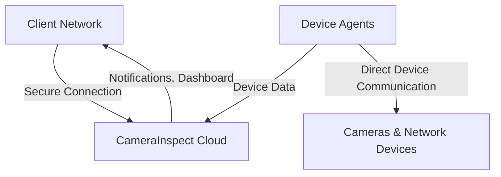
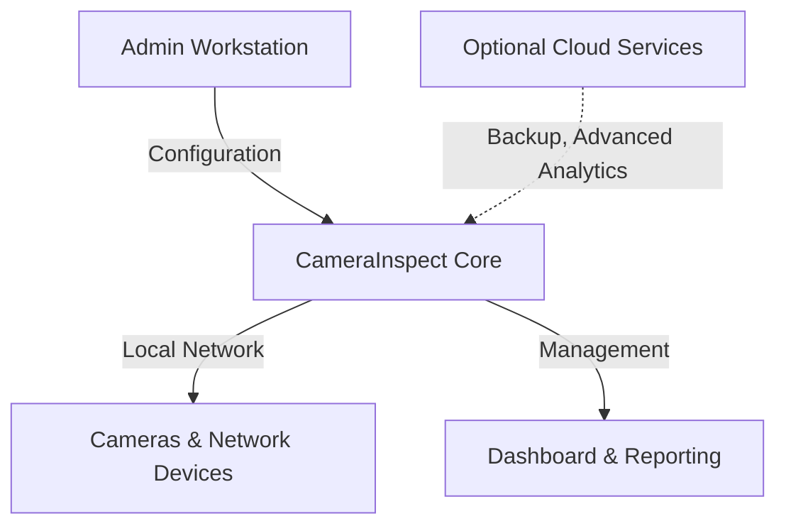
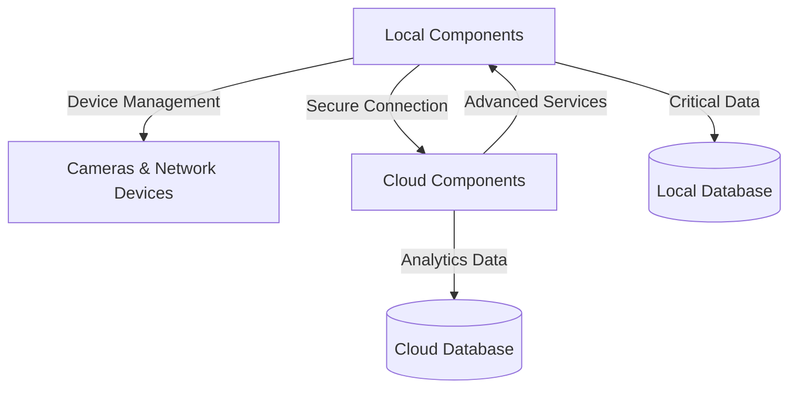

# System Architecture

This document describes the architecture of the CameraInspect system, detailing its components, their interactions, and the underlying technologies.

## Overview

CameraInspect is built on a modern, microservices-based architecture that provides scalability, resilience, and flexibility. The system is designed to handle environments ranging from small installations with a few cameras to enterprise deployments with thousands of devices across multiple locations.

## System Components

The following diagram illustrates the high-level architecture of CameraInspect:



### Core Components

1. **UI Layer**
    * Web-based interface accessible via browsers
    * Mobile application for iOS and Android
    * Admin dashboard for system management
    * Command-line interface for advanced operations

2. **API Gateway**
    * Central entry point for all client requests
    * Request routing and load balancing
    * Authentication and authorization
    * Rate limiting and throttling
    * Response caching
    * API versioning

3. **Microservices**
    * **Diagnostics Service**: Network analysis, device discovery, problem detection
    * **Configuration Service**: Device configuration, templates, bulk operations
    * **Monitoring Service**: Real-time device monitoring, alerts, health checks
    * **Reporting Service**: Data analytics, report generation, scheduled reporting
    * **User Management Service**: Authentication, permissions, user preferences

4. **WebSocket Server**
    * Real-time event delivery to client applications
    * Status updates and notifications
    * Live device data streaming

5. **Message Queue**
    * Asynchronous communication between services
    * Event processing and propagation
    * System state changes broadcast

6. **Database Cluster**
    * Primary data storage for application data
    * Distributed and replicated for high availability
    * Sharded for performance at scale

7. **Device Agents**
    * Lightweight software running on network segments
    * Direct communication with network devices and cameras
    * Local buffering during network interruptions
    * Edge processing capabilities

## Deployment Models

CameraInspect supports multiple deployment models to meet various customer requirements:

### Cloud-Based Deployment (SaaS)



* All CameraInspect services hosted in secure cloud infrastructure
* Automatic updates and maintenance
* Elastic scaling based on demand
* Globally distributed for low latency
* Data stored in region-specific data centers for compliance

### On-Premises Deployment



* All services deployed within customer's network
* Data remains within customer's infrastructure
* Customizable hardware requirements
* Optional cloud connections for specific services
* Manual or scheduled updates

### Hybrid Deployment



* Business-critical components deployed on-premises
* Advanced analytics and reporting in the cloud
* Selective data sharing between environments
* Resilient operation during internet outages
* Flexible scaling of cloud resources

## Security Architecture

Security is a fundamental aspect of the CameraInspect architecture, implemented at multiple layers:

### Network Security

* TLS 1.3 for all communications
* IP-based access controls
* Network traffic encryption
* Segmented network design with strict access controls

### Authentication & Authorization

* Multi-factor authentication support
* Role-based access control (RBAC)
* OAuth 2.0 and OpenID Connect
* Fine-grained permission model
* JWT with short expiration times

### Data Security

* Encryption at rest using AES-256
* Encryption in transit for all data flows
* Data anonymization capabilities
* Strict data retention policies
* Regular security audits and penetration testing

### Operational Security

* Automated vulnerability scanning
* Containerized services with security isolation
* Principle of least privilege
* Comprehensive audit logging
* Automated threat detection

## Storage Architecture

The system employs a multi-tiered storage architecture to optimize for different access patterns:

```mermaid
graph TB
    HOT[Hot Storage] --> |Aging| WARM[Warm Storage]
    WARM --> |Aging| COLD[Cold Storage]
    
    HOT --> |Recent Data| QUERY[Query Service]
    WARM --> |Historical Data| QUERY
    COLD --> |Archive| BACKUP[Backup Service]
    
    HOT --> |Fast Access| DASH[Dashboard]
