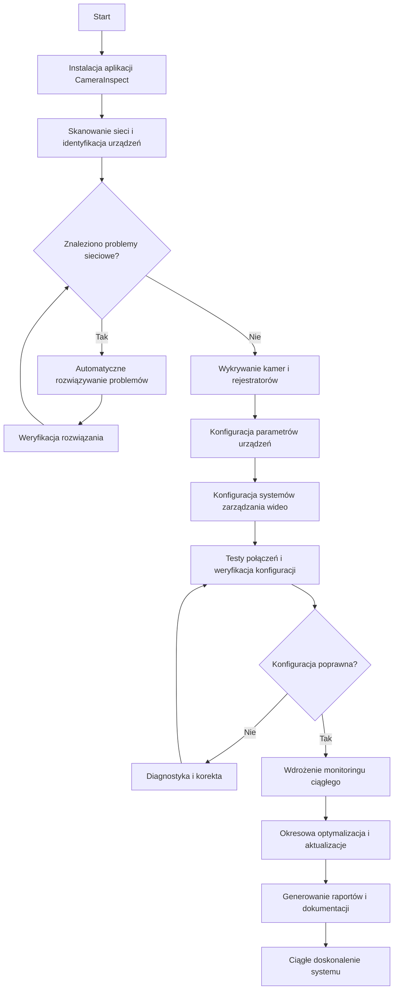
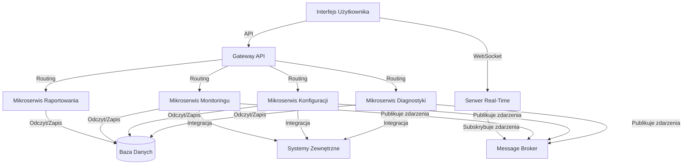

# [docs.camerainspect.com](http://docs.camerainspect.com)

## menu

+ [camerainspect.com](http://www.camerainspect.com)
+ [docs](http://docs.camerainspect.com)
+ [logo](http://logo.camerainspect.com)
+ [roadmap](http://roadmap.camerainspect.com)
+ [identity](http://identity.camerainspect.com)


## [contribution](http://contribution.softreck.dev)

+ [issue](https://github.com/camerainspect/docs/issues/new)
+ [edit](https://github.com/camerainspect/docs/edit/main/README.md)
+ [git](https://github.com/camerainspect/) 


- Dobre rozwiązanie dla firm z rozproszonymi lokalizacjami lub specjalnymi wymaganiami bezpieczeństwa

### Proces wdrożenia

Standardowy proces wdrożenia CameraInspect składa się z następujących etapów:

1. **Analiza wymagań**
    - Identyfikacja potrzeb i celów
    - Inwentaryzacja istniejącej infrastruktury
    - Określenie zakresu wdrożenia
    - Identyfikacja potencjalnych wyzwań

2. **Planowanie**
    - Przygotowanie harmonogramu wdrożenia
    - Projektowanie architektury rozwiązania
    - Przygotowanie planu migracji
    - Określenie zasobów i odpowiedzialności

3. **Instalacja i konfiguracja**
    - Przygotowanie środowiska
    - Instalacja oprogramowania
    - Podstawowa konfiguracja systemu
    - Integracja z istniejącymi systemami

4. **Dostosowanie i optymalizacja**
    - Konfiguracja pod specyficzne wymagania
    - Optymalizacja wydajności
    - Dostosowanie interfejsu użytkownika
    - Konfiguracja raportów i alertów

5. **Testowanie**
    - Testy funkcjonalne
    - Testy wydajnościowe
    - Testy bezpieczeństwa
    - Testy akceptacyjne

6. **Szkolenie**
    - Szkolenie administratorów
    - Szkolenie użytkowników końcowych
    - Przygotowanie dokumentacji
    - Przekazanie wiedzy

7. **Uruchomienie produkcyjne**
    - Finalna migracja danych
    - Uruchomienie monitoringu
    - Wsparcie podczas startu produkcyjnego
    - Przekazanie systemu do użytkowania

8. **Wsparcie powdrożeniowe**
    - Monitorowanie wydajności
    - Rozwiązywanie problemów
    - Optymalizacja i dostrajanie
    - Regularne przeglądy systemu

## Dokumentacja API

CameraInspect udostępnia kompletne API REST, umożliwiające integrację z systemami zewnętrznymi i tworzenie własnych rozszerzeń.

### Uwierzytelnianie

API wykorzystuje uwierzytelnianie OAuth 2.0 z tokenami JWT. Proces uwierzytelniania:

```
POST /api/v1/auth/token
Content-Type: application/json

{
  "client_id": "your_client_id",
  "client_secret": "your_client_secret",
  "grant_type": "client_credentials"
}
```

Odpowiedź:

```json
{
  "access_token": "eyJhbGciOiJIUzI1NiIsInR5cCI6IkpXVCJ9...",
  "token_type": "Bearer",
  "expires_in": 3600
}
```

### Główne endpointy API

#### Zarządzanie urządzeniami

- `GET /api/v1/devices` - Lista wszystkich urządzeń
- `GET /api/v1/devices/{id}` - Szczegóły urządzenia
- `POST /api/v1/devices` - Dodanie nowego urządzenia
- `PUT /api/v1/devices/{id}` - Aktualizacja urządzenia
- `DELETE /api/v1/devices/{id}` - Usunięcie urządzenia
- `GET /api/v1/devices/{id}/status` - Status urządzenia
- `POST /api/v1/devices/{id}/reboot` - Restart urządzenia

#### Konfiguracja

- `GET /api/v1/config/templates` - Lista szablonów konfiguracji
- `POST /api/v1/config/apply` - Zastosowanie konfiguracji
- `GET /api/v1/config/history` - Historia zmian konfiguracji
- `POST /api/v1/config/backup` - Tworzenie kopii zapasowej konfiguracji
- `POST /api/v1/config/restore` - Przywracanie konfiguracji z kopii

#### Diagnostyka

- `POST /api/v1/diagnostics/network/scan` - Skanowanie sieci
- `GET /api/v1/diagnostics/network/status` - Status sieci
- `POST /api/v1/diagnostics/connection/test` - Test połączenia
- `GET /api/v1/diagnostics/logs` - Pobieranie logów
- `POST /api/v1/diagnostics/troubleshoot` - Automatyczne rozwiązywanie problemów

#### Monitorowanie

- `GET /api/v1/monitoring/alerts` - Lista aktywnych alertów
- `GET /api/v1/monitoring/metrics` - Metryki wydajności
- `POST /api/v1/monitoring/alerts/settings` - Konfiguracja alertów
- `GET /api/v1/monitoring/health` - Status zdrowia systemu
- `GET /api/v1/monitoring/uptime` - Statystyki dostępności

#### Raportowanie

- `GET /api/v1/reports/templates` - Lista szablonów raportów
- `POST /api/v1/reports/generate` - Generowanie raportu
- `GET /api/v1/reports/history` - Historia raportów
- `GET /api/v1/reports/{id}` - Pobieranie raportu
- `POST /api/v1/reports/schedule` - Harmonogramowanie raportów

### Przykład integracji

Przykład kodu w Python wykorzystującego API CameraInspect:

```python
import requests
import json

# Konfiguracja
API_URL = "https://api.camerainspect.com/api/v1"
CLIENT_ID = "your_client_id"
CLIENT_SECRET = "your_client_secret"

# Uwierzytelnianie
def get_token():
    auth_url = f"{API_URL}/auth/token"
    payload = {
        "client_id": CLIENT_ID,
        "client_secret": CLIENT_SECRET,
        "grant_type": "client_credentials"
    }
    response = requests.post(auth_url, json=payload)
    return response.json()["access_token"]

# Pobieranie listy urządzeń
def get_devices():
    token = get_token()
    headers = {"Authorization": f"Bearer {token}"}
    response = requests.get(f"{API_URL}/devic# [CameraInspect - Inteligentny Asystent Konfiguracji Systemów Monitoringu](http://www.camerainspect.com)

[](https://github.com/camerainspect/www/stargazers) [](https://github.com/camerainspect/www/fork) [](https://github.com/camerainspect/www/watchers) [](https://github.com/camerainspect) [](https://hits.seeyoufarm.com)

**Motto:** Humanless Support


## Spis treści

- [O projekcie](#o-projekcie)
- [Kluczowe funkcjonalności](#kluczowe-funkcjonalności)
- [Dla kogo jest CameraInspect](#dla-kogo-jest-camerainspect)
- [Jak to działa](#jak-to-działa)
- [Case Studies](#case-studies)
- [Architektura systemu](#architektura-systemu)
- [Technologie](#technologie)
- [Interfejs użytkownika](#interfejs-użytkownika)
- [Instalacja i wdrożenie](#instalacja-i-wdrożenie)
- [Dokumentacja API](#dokumentacja-api)
- [Bezpieczeństwo](#bezpieczeństwo)
- [Plan rozwoju](#plan-rozwoju)
- [Wsparcie techniczne](#wsparcie-techniczne)
- [FAQ](#faq)
- [Cennik](#cennik)
- [Kontakt](#kontakt)
- [Informacje o firmie](#informacje-o-firmie)

## O projekcie

### Przeznaczenie CameraInspect

CameraInspect to kompleksowe rozwiązanie do automatycznej diagnostyki, konfiguracji i zarządzania systemami monitoringu wizyjnego. Narzędzie zostało zaprojektowane, aby w pełni zautomatyzować procesy, które tradycyjnie wymagały zaangażowania doświadczonych techników i inżynierów IT.

#### Kluczowe wyzwania w systemach monitoringu, które rozwiązuje CameraInspect:

1. **Złożoność wdrożenia** - Instalacja systemów kamer wymaga wiedzy specjalistycznej z zakresu sieci, protokołów transmisji, konfiguracji urządzeń i optymalizacji obrazu.

2. **Czasochłonna konfiguracja** - Ręczna konfiguracja dużej liczby kamer może zajmować tygodnie, angażując znaczne zasoby IT.

3. **Trudności diagnostyczne** - Wykrywanie i rozwiązywanie problemów w systemach monitoringu często wymaga czasochłonnej analizy wielu aspektów: jakości sygnału, przepustowości sieci, konfiguracji portów i usług.

4. **Brak centralizacji** - Firmy z wieloma lokalizacjami mają trudności z utrzymaniem spójnych standardów i centralnym zarządzaniem rozproszonym systemem monitoringu.

5. **Wysoki koszt utrzymania** - Regularne wizyty serwisowe, aktualizacje i rekonfiguracje generują znaczne koszty operacyjne.

CameraInspect automatyzuje te procesy, wykorzystując zaawansowane algorytmy analizy sieci, uczenie maszynowe do wykrywania problemów i optymalizacji oraz intuicyjny interfejs, który prowadzi użytkownika przez cały proces konfiguracji.

### Podejście "Humanless Support"

Filozofia "Humanless Support" stanowi fundament CameraInspect. Oznacza to, że system został zaprojektowany by minimalizować konieczność ingerencji człowieka poprzez:

- **Autonomiczną diagnostykę** - System samodzielnie wykrywa i analizuje problemy, bez potrzeby ręcznej interpretacji danych diagnostycznych.
- **Automatyczną naprawę** - Wiele problemów jest rozwiązywanych automatycznie, bez ingerencji użytkownika.
- **Proaktywną optymalizację** - System stale monitoruje i optymalizuje działanie sieci i kamer, zanim pojawią się problemy.
- **Kontekstowe podpowiedzi** - W przypadkach, gdy konieczna jest interwencja użytkownika, system dostarcza precyzyjne instrukcje dostosowane do konkretnej sytuacji.

## Kluczowe funkcjonalności

### 1. Automatyczna Diagnostyka Sieci
- **Kompleksowy audyt infrastruktury** - Skanowanie całej infrastruktury sieciowej w poszukiwaniu potencjalnych problemów.
- **Analiza przepustowości i opóźnień** - Testowanie parametrów sieci pod kątem obsługi transmisji wideo w czasie rzeczywistym.
- **Wykrywanie konfliktów adresów IP** - Automatyczne rozpoznawanie i rozwiązywanie konfliktów adresacji IP.
- **Analiza routingu** - Weryfikacja optymalnych ścieżek transmisji danych.
- **Testowanie zapór sieciowych i reguł NAT** - Wykrywanie blokad w transmisji danych wideo.
- **Analiza QoS** - Weryfikacja priorytetyzacji ruchu dla strumieni wideo.

### 2. Inteligentny Kreator Konfiguracji
- **Automatyczne wykrywanie urządzeń** - Skanowanie sieci i identyfikacja wszystkich kamer i rejestratorów.
- **Konfiguracja parametrów obrazu** - Automatyczna optymalizacja rozdzielczości, klatek na sekundę, kodowania i kompresji.
- **Konfiguracja zabezpieczeń** - Ustawianie silnych haseł, szyfrowania i innych parametrów bezpieczeństwa.
- **Konfiguracja zaawansowanych funkcji** - Automatyczne ustawianie detekcji ruchu, analityki wideo i innych funkcji.
- **Integracja z systemami VMS** - Automatyczna konfiguracja oprogramowania do zarządzania wideo.
- **Kreator oparty na szablonach** - Możliwość wykorzystania predefiniowanych konfiguracji dla typowych scenariuszy.

### 3. Zaawansowana Diagnostyka
- **Monitoring stanu kamer w czasie rzeczywistym** - Ciągła weryfikacja statusu wszystkich urządzeń.
- **Analiza jakości obrazu** - Automatyczna detekcja problemów z jakością, ostrością, ekspozycją.
- **Wykrywanie utraty sygnału** - Natychmiastowe powiadomienia o przerwach w transmisji.
- **Audyt bezpieczeństwa** - Regularna weryfikacja zabezpieczeń i wykrywanie potencjalnych luk.
- **Analiza wydajności pamięci masowej** - Monitorowanie i optymalizacja przestrzeni dyskowej.
- **Predykcyjna analiza awarii** - Wykorzystanie uczenia maszynowego do przewidywania potencjalnych problemów.

### 4. Raportowanie i Dokumentacja
- **Automatyczne generowanie raportów technicznych** - Szczegółowa dokumentacja całego systemu.
- **Inwentaryzacja sprzętu** - Automatyczne tworzenie i aktualizacja rejestru wszystkich urządzeń.
- **Historia zmian konfiguracji** - Śledzenie wszystkich modyfikacji systemu.
- **Dokumentacja topologii sieci** - Automatyczne mapowanie i wizualizacja infrastruktury.
- **Eksport do różnych formatów** - Możliwość eksportu danych do PDF, CSV, Excel i innych formatów.
- **Automatyczne harmonogramy raportów** - Regularne generowanie i dystrybucja raportów dla interesariuszy.

### 5. Centralne Zarządzanie
- **Jednolity interfejs dla wszystkich lokalizacji** - Zarządzanie rozproszonymi systemami z jednego miejsca.
- **Grupowe polityki konfiguracji** - Wdrażanie standardów konfiguracji w całej organizacji.
- **Zarządzanie uprawnieniami** - Centralne zarządzanie dostępem użytkowników i administratorów.
- **Synchronizacja konfiguracji** - Automatyczna replikacja ustawień między lokalizacjami.
- **Centralne aktualizacje** - Koordynacja aktualizacji oprogramowania dla wszystkich urządzeń.
- **Monitorowanie statusu wszystkich systemów** - Pulpit z informacjami o stanie wszystkich lokalizacji.

## Dla kogo jest CameraInspect

### Sektory i branże

CameraInspect jest idealnym rozwiązaniem dla:

1. **Handel detaliczny**
   - Sieci sklepów z wieloma lokalizacjami
   - Centra handlowe
   - Supermarkety i hipermarkety
   - Sklepy convenience

2. **Logistyka i transport**
   - Centra dystrybucyjne
   - Magazyny
   - Terminale logistyczne
   - Floty transportowe
   - Monitoring dróg i autostrad

3. **Hotelarstwo i turystyka**
   - Hotele i resorty
   - Kompleksy wypoczynkowe
   - Parki rozrywki
   - Obiekty kulturalne i muzea

4. **Produkcja przemysłowa**
   - Fabryki i zakłady produkcyjne
   - Linie montażowe
   - Monitoring procesów produkcyjnych
   - Kontrola jakości

5. **Instytucje publiczne**
   - Szkoły i uczelnie
   - Urzędy i instytucje rządowe
   - Szpitale i placówki medyczne
   - Monitoring miejski

6. **Obiekty biurowe**
   - Biurowce
   - Kompleksy biurowe
   - Przestrzenie coworkingowe
   - Centra konferencyjne

### Role użytkowników

CameraInspect jest szczególnie przydatny dla:

1. **Administratorów systemów bezpieczeństwa**
   - Upraszcza konfigurację i zarządzanie systemami
   - Redukuje czas potrzebny na diagnostykę i rozwiązywanie problemów
   - Zapewnia kompleksowy wgląd w stan systemów

2. **Działów IT**
   - Minimalizuje obciążenie zespołów IT
   - Automatyzuje rutynowe zadania administracyjne
   - Zapewnia spójność konfiguracji i polityk bezpieczeństwa

3. **Menedżerów ds. bezpieczeństwa**
   - Dostarcza kompleksowe raporty i analizy
   - Umożliwia strategiczne planowanie rozwoju systemów
   - Zapewnia widoczność wszystkich aspektów bezpieczeństwa

4. **Firm instalacyjnych i integratorów**
   - Przyspiesza proces wdrożenia i konfiguracji
   - Redukuje liczbę błędów podczas instalacji
   - Zapewnia kompleksową dokumentację systemu

5. **Kierownictwa wyższego szczebla**
   - Redukuje koszty operacyjne związane z utrzymaniem systemów
   - Zapewnia przejrzystość inwestycji w bezpieczeństwo
   - Dostarcza mierzalne wskaźniki wydajności systemu

## Jak to działa

### Proces w 3 krokach:

#### 1. Diagnostyka sieci
CameraInspect przeprowadza kompleksową analizę infrastruktury sieciowej poprzez:
- Skanowanie wszystkich urządzeń sieciowych i identyfikację ich parametrów
- Testowanie połączeń, przepustowości i stabilności sieci
- Wykrywanie potencjalnych problemów i konfliktów
- Analizę ruchu sieciowego i identyfikację wąskich gardeł
- Weryfikację konfiguracji urządzeń sieciowych (routery, switche, firewalle)
- Generowanie raportu z zaleceniami optymalizacyjnymi

#### 2. Automatyczna konfiguracja
System prowadzi użytkownika przez proces konfiguracji, automatyzując:
- Wykrywanie wszystkich kamer i urządzeń do rejestracji obrazu
- Konfigurację parametrów sieciowych (IP, maski, bramy, DNS)
- Ustawianie parametrów obrazu (rozdzielczość, liczba klatek, kompresja)
- Konfigurację zabezpieczeń dostępu i transmisji
- Integrację z systemami zarządzania wideo
- Konfigurację analityki wideo i detekcji zdarzeń
- Ustawianie harmonogramów nagrywania i retencji danych

#### 3. Monitoring i optymalizacja
Po wdrożeniu system zapewnia ciągłe monitorowanie i optymalizację poprzez:
- Ciągłą weryfikację stanu i dostępności wszystkich urządzeń
- Monitorowanie jakości obrazu i parametrów transmisji
- Automatyczną detekcję anomalii i potencjalnych problemów
- Regularne testy wydajności i bezpieczeństwa
- Okresowe optymalizacje konfiguracji w oparciu o analizę użytkowania
- Automatyczne aktualizacje oprogramowania i firmware
- Generowanie raportów z wykorzystania i wydajności systemu

### Szczegółowy diagram procesu



## Case Studies

### Przypadek 1: Sieć Sklepów Spożywczych

#### Wyzwanie:
- 50 lokalizacji rozproszonych po całym kraju
- Przestarzały system monitoringu z różnymi typami kamer
- Brak specjalistów IT w poszczególnych lokalizacjach
- Wysokie koszty serwisu wymagające częstych wizyt techników
- Niekonsekwentne standardy bezpieczeństwa w różnych lokalizacjach
- Problemy z centralnym dostępem do nagrań

#### Rozwiązanie:
- Wdrożenie CameraInspect Professional z centralnym zarządzaniem
- Kompleksowa inwentaryzacja i dokumentacja istniejącej infrastruktury
- Zdalna konfiguracja wszystkich systemów z jednego centralnego punktu
- Standaryzacja ustawień bezpieczeństwa i jakości obrazu
- Automatyczna diagnostyka i monitoring wydajności systemu
- Wdrożenie protokołów automatycznych aktualizacji

#### Rezultaty:
- Redukcja kosztów serwisu o 45% poprzez eliminację większości wizyt terenowych
- Czas wdrożenia skrócony z 6 do 2 miesięcy dzięki automatyzacji procesu
- ROI osiągnięte po 4 miesiącach od zakończenia wdrożenia
- Ujednolicenie standardów bezpieczeństwa we wszystkich lokalizacjach
- Centralizacja zarządzania umożliwiająca szybkie wdrażanie zmian
- Zmniejszenie liczby incydentów związanych z awariami systemu o 68%

### Przypadek 2: Hotel

#### Wyzwanie:
- Obiekt z 200 kamerami różnych producentów
- Złożona infrastruktura sieciowa z licznymi podsieciami
- Częste problemy z jakością obrazu i utratą połączenia
- Brak kompleksowej dokumentacji technicznej systemu
- Wysokie koszty utrzymania wymagające stałej obecności technika
- Przestarzałe metody zarządzania nagraniami

#### Rozwiązanie:
- Wdrożenie CameraInspect Enterprise z zaawansowaną diagnostyką sieci
- Pełna inwentaryzacja i mapowanie systemu, z uwzględnieniem wszystkich połączeń
- Rekonfiguracja sieci w celu optymalizacji przepustowości dla transmisji wideo
- Automatyczna optymalizacja parametrów kamer do warunków oświetleniowych
- Implementacja zaawansowanego systemu monitorowania stanu technicznego
- Centralizacja zarządzania nagraniami z zaawansowanym wyszukiwaniem

#### Rezultaty:
- 70% redukcja incydentów technicznych dzięki proaktywnemu monitorowaniu
- Miesięczna oszczędność 15,000 PLN z eliminacji stałej obsługi technicznej
- Zwiększenie niezawodności do 99.9% dostępności systemu
- Poprawa jakości obrazu poprzez inteligentną optymalizację parametrów
- Szybszy dostęp do nagrań archiwalnych dzięki zaawansowanemu indeksowaniu
- Kompletna dokumentacja techniczna ułatwiająca przyszłe rozbudowy

### Przypadek 3: Firma Logistyczna

#### Wyzwanie:
- 20 magazynów rozproszonych w całym kraju
- Różnorodne i niekompatybilne systemy kamer wdrożone lokalnie
- Problemy z integracją systemów bezpieczeństwa
- Brak centralnego zarządzania i spójnych polityk bezpieczeństwa
- Trudności w koordynacji działań służb ochrony między lokalizacjami
- Wysokie koszty administracyjne związane z rozproszoną infrastrukturą

#### Rozwiązanie:
- Wdrożenie CameraInspect Enterprise z modułem integracji systemów
- Unifikacja systemów poprzez warstwy integracyjne
- Centralne zarządzanie wszystkimi lokalizacjami z jednego interfejsu
- Automatyzacja procesów monitorowania i raportowania
- Wdrożenie wspólnych standardów bezpieczeństwa i polityk retencji danych
- Integracja z systemami kontroli dostępu i zarządzania magazynem

#### Rezultaty:
- Redukcja kosztów IT o 35% dzięki centralizacji zarządzania
- Czas reakcji na incydenty skrócony o 80% dzięki natychmiastowej notyfikacji
- Pełna integracja wszystkich systemów niezależnie od producenta
- Zwiększona wydajność pracy służb ochrony dzięki zautomatyzowanym procedurom
- Poprawa bezpieczeństwa dzięki spójnym standardom we wszystkich lokalizacjach
- Lepsze wsparcie dla procesów logistycznych poprzez integrację z systemami magazynowymi

## Architektura systemu

CameraInspect zbudowany jest w oparciu o nowoczesną, modułową architekturę mikroserwisową, zapewniającą skalowalność, elastyczność i niezawodność.

### Warstwy systemu

1. **Warstwa interfejsu użytkownika**
    - Responsywny interfejs webowy dostępny z dowolnej przeglądarki
    - Aplikacja mobilna dla systemów iOS i Android
    - Pulpity zarządzania dostosowane do różnych ról użytkowników
    - Interfejs API dla integracji z systemami zewnętrznymi

2. **Warstwa logiki biznesowej**
    - Mikroserwisy odpowiedzialne za poszczególne funkcjonalności
    - Moduł diagnostyki sieci
    - Moduł konfiguracji kamer
    - Moduł monitoringu i raportowania
    - Moduł analizy i optymalizacji
    - Silnik automatyzacji procesów

3. **Warstwa integracji**
    - Adaptery do różnych systemów kamer i rejestratorów
    - Integracje z systemami VMS (Video Management Systems)
    - Integracje z systemami zarządzania infrastrukturą IT
    - Konektory do systemów kontroli dostępu i alarmowych
    - Integracje z systemami business intelligence

4. **Warstwa danych**
    - Rozproszona baza danych
    - System zarządzania konfiguracjami
    - Repozytorium metadanych
    - System analityki danych

### Diagram architektury



## Technologie

CameraInspect został zbudowany w oparciu o najnowocześniejsze technologie, zapewniające wydajność, skalowalność i bezpieczeństwo.

### Frontend
- **HTML5, CSS3, JavaScript** - podstawowe technologie dla interfejsu użytkownika
- **React.js** - biblioteka do budowania interaktywnych interfejsów
- **Tailwind CSS** - framework CSS dla responsywnego designu
- **D3.js** - biblioteka do wizualizacji danych i interaktywnych wykresów
- **WebSocket** - technologia komunikacji w czasie rzeczywistym

### Backend
- **Node.js** - środowisko uruchomieniowe JavaScript
- **Express.js** - framework do budowy API
- **Python** - język dla modułów analizy danych i uczenia maszynowego
- **Docker** - konteneryzacja dla łatwego wdrażania
- **Kubernetes** - orkiestracja kontenerów dla skalowalności

### Bazy danych
- **MongoDB** - baza danych NoSQL dla elastycznego przechowywania danych
- **Redis** - baza danych w pamięci dla pamięci podręcznej i obsługi sesji
- **InfluxDB** - baza czasowa dla danych telemetrycznych
- **Elasticsearch** - silnik wyszukiwania dla szybkiego dostępu do logów i metadanych

### Narzędzia DevOps
- **GitLab CI/CD** - ciągła integracja i wdrażanie
- **Prometheus** - monitoring i alerty
- **Grafana** - wizualizacja metryk i dashboardy
- **ELK Stack** - zarządzanie logami i analityka
- **Terraform** - infrastruktura jako kod

### Bezpieczeństwo
- **OAuth 2.0 / OpenID Connect** - standard uwierzytelniania
- **JWT** - tokeny bezpieczeństwa
- **HTTPS/TLS** - szyfrowanie komunikacji
- **HashiCorp Vault** - zarządzanie sekretami
- **WAF** - zapora aplikacji webowych

## Interfejs użytkownika

CameraInspect oferuje intuicyjny, przejrzysty interfejs użytkownika, zaprojektowany zgodnie z najnowszymi standardami UX/UI.

### Główne sekcje interfejsu

1. **Pulpit** - Centralny punkt zarządzania z widokiem najważniejszych wskaźników:
    - Status systemu
    - Aktywne alerty
    - Statystyki wydajności
    - Szybki dostęp do najczęściej używanych funkcji

2. **Mapa sieci** - Interaktywna wizualizacja infrastruktury:
    - Graficzna reprezentacja wszystkich urządzeń
    - Status połączeń
    - Przepustowość i obciążenie
    - Możliwość nawigacji i powiększania

3. **Zarządzanie urządzeniami** - Kompleksowe zarządzanie kamerami:
    - Lista wszystkich urządzeń z filtrowaniem i wyszukiwaniem
    - Szczegółowe informacje o każdym urządzeniu
    - Podgląd obrazu na żywo
    - Szybki dostęp do konfiguracji

4. **Konfiguracja** - Zaawansowane opcje konfiguracyjne:
    - Kreator konfiguracji dla nowych wdrożeń
    - Szablony konfiguracji
    - Grupowa konfiguracja urządzeń
    - Historia zmian konfiguracji

5. **Diagnostyka** - Narzędzia do rozwiązywania problemów:
    - Testy połączeń
    - Analiza przepustowości
    - Dzienniki systemowe
    - Narzędzia do rozwiązywania problemów

6. **Raportowanie** - Kompleksowe raportowanie:
    - Gotowe szablony raportów
    - Możliwość tworzenia niestandardowych raportów
    - Harmonogramy automatycznego raportowania
    - Eksport do różnych formatów

7. **Administracja** - Zarządzanie systemem:
    - Zarządzanie użytkownikami i uprawnieniami
    - Ustawienia systemowe
    - Zarządzanie licencjami
    - Aktualizacje i kopie zapasowe

### Wersja mobilna

Aplikacja mobilna CameraInspect oferuje:
- Powiadomienia w czasie rzeczywistym o alertach
- Podgląd kamer z dowolnego miejsca
- Podstawową diagnostykę i rozwiązywanie problemów
- Szybki dostęp do najważniejszych funkcji zarządzania

## Instalacja i wdrożenie

CameraInspect oferuje elastyczne opcje wdrożenia, dostosowane do różnych potrzeb i środowisk.

### Wymagania systemowe

#### Serwer:
- **Procesor:** Min. 4 rdzenie, zalecane 8+ rdzeni
- **RAM:** Min. 8GB, zalecane 16GB+
- **Dysk:** Min. 100GB SSD
- **System operacyjny:** Linux (Ubuntu 20.04+, CentOS 8+), Windows Server 2019+
- **Baza danych:** MongoDB 4.4+, Redis 6.0+
- **Sieć:** Stałe połączenie internetowe, min. 100 Mbps

#### Klient:
- **Przeglądarki:** Chrome 80+, Firefox 75+, Edge 80+, Safari 13+
- **Systemy mobilne:** iOS 13+, Android 9+
- **Minimalna rozdzielczość:** 1280x720 px

### Metody wdrożenia

#### 1. On-premises
- Instalacja w środowisku lokalnym klienta
- Pełna kontrola nad danymi i infrastrukturą
- Możliwość integracji z istniejącymi systemami bezpieczeństwa
- Zalecane dla dużych organizacji z własnymi zasobami IT

#### 2. Chmura prywatna
- Wdrożenie w prywatnej chmurze klienta
- Lepsza skalowalność i elastyczność niż wdrożenie on-premises
- Zachowanie kontroli nad danymi
- Idealne dla średnich i dużych organizacji

#### 3. SaaS (Software as a Service)
- Rozwiązanie hostowane przez CameraInspect
- Szybkie wdrożenie bez inwestycji w infrastrukturę
- Automatyczne aktualizacje i konserwacja
- Doskonałe dla małych i średnich firm

#### 4. Model hybrydowy
- Część funkcji w chmurze, część lokalnie
- Optymalizacja kosztów i wydajności
- Elastyczne dostosowanie do potrzeb organizacji
- Dobre rozwiązanie dla
