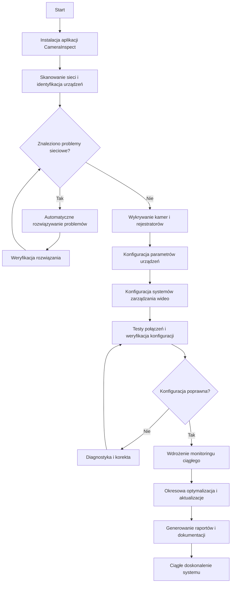

# Jak działa CameraInspect

CameraInspect wykorzystuje zaawansowaną automatyzację, aby uprościć proces wdrażania i zarządzania systemami monitoringu. W tej sekcji opisujemy szczegółowo, jak działa system i jakie procesy są realizowane na poszczególnych etapach.

## Proces w 3 krokach

Podstawowy proces działania CameraInspect można podzielić na trzy główne etapy:

### 1. Diagnostyka sieci

CameraInspect przeprowadza kompleksową analizę infrastruktury sieciowej poprzez:

- **Skanowanie infrastruktury sieciowej**
    - Identyfikacja wszystkich urządzeń w sieci
    - Analiza topologii sieci
    - Wykrywanie urządzeń sieciowych (routery, switche, firewalle)
    - Mapowanie połączeń między urządzeniami

- **Testowanie parametrów sieciowych**
    - Pomiar przepustowości między kluczowymi punktami
    - Analiza opóźnień i jittera
    - Weryfikacja stabilności połączeń
    - Testowanie redundancji i mechanizmów failover

- **Identyfikacja potencjalnych problemów**
    - Wykrywanie konfliktów adresów IP
    - Identyfikacja przeciążonych segmentów sieci
    - Analiza konfiguracji VLAN
    - Weryfikacja poprawności ustawień DNS i DHCP

- **Analiza bezpieczeństwa sieci**
    - Skanowanie otwartych portów
    - Weryfikacja konfiguracji zapór sieciowych
    - Sprawdzanie poprawności reguł NAT
    - Identyfikacja potencjalnych luk w zabezpieczeniach

- **Generowanie raportu diagnostycznego**
    - Szczegółowy raport o stanie sieci
    - Lista zidentyfikowanych problemów
    - Rekomendacje optymalizacyjne
    - Plan działań naprawczych

### 2. Automatyczna konfiguracja

System prowadzi użytkownika przez proces konfiguracji, automatyzując:

- **Wykrywanie urządzeń monitoringu**
    - Automatyczne skanowanie sieci w poszukiwaniu kamer i rejestratorów
    - Identyfikacja modeli i producentów
    - Weryfikacja wersji firmware
    - Inwentaryzacja istniejących urządzeń

- **Konfiguracja parametrów sieciowych**
    - Przypisanie optymalnych adresów IP
    - Konfiguracja masek podsieci i bram
    - Ustawienia DNS i DHCP
    - Konfiguracja portów i przekierowań

- **Optymalizacja parametrów obrazu**
    - Dostosowanie rozdzielczości do potrzeb i przepustowości
    - Optymalizacja liczby klatek na sekundę
    - Konfiguracja kompresji i kodowania
    - Dostosowanie parametrów do warunków oświetleniowych

- **Konfiguracja zabezpieczeń**
    - Zmiana domyślnych haseł
    - Implementacja zasad bezpieczeństwa
    - Konfiguracja szyfrowania
    - Ustawienia uprawnień dostępu

- **Integracja z systemami zarządzania**
    - Konfiguracja połączenia z systemami VMS
    - Ustawienia rejestracji i archiwizacji
    - Konfiguracja powiadomień i alertów
    - Integracja z innymi systemami bezpieczeństwa

### 3. Monitoring i optymalizacja

Po wdrożeniu system zapewnia ciągłe monitorowanie i optymalizację poprzez:

- **Ciągły monitoring stanu systemu**
    - Regularne sprawdzanie dostępności wszystkich urządzeń
    - Monitoring parametrów wydajnościowych
    - Analiza jakości obrazu
    - Weryfikacja poprawności nagrywania

- **Automatyczna detekcja problemów**
    - Wykrywanie utraty sygnału
    - Identyfikacja problemów z jakością obrazu
    - Monitoring obciążenia sieci
    - Wykrywanie problemów z pamięcią masową

- **Proaktywna optymalizacja**
    - Automatyczne dostosowanie parametrów do zmieniających się warunków
    - Optymalizacja wykorzystania przepustowości
    - Dynamiczne zarządzanie przestrzenią dyskową
    - Równoważenie obciążenia

- **Regularne testy i weryfikacje**
    - Automatyczne testy połączeń
    - Weryfikacja dostępności funkcji
    - Testy zabezpieczeń
    - Kontrola integralności danych

- **Raportowanie i analityka**
    - Generowanie raportów o stanie systemu
    - Analiza trendów i wzorców
    - Identyfikacja obszarów wymagających uwagi
    - Rekomendacje dalszych optymalizacji

## Szczegółowy diagram procesu

## Technologia stojąca za automatyzacją

CameraInspect wykorzystuje szereg zaawansowanych technologii, aby zapewnić wysoką skuteczność automatyzacji:

### Automatyczna diagnostyka

- **Algorytmy analizy sieci** - Zaawansowane algorytmy do identyfikacji i diagnozowania problemów sieciowych
- **Techniki głębokiej inspekcji pakietów** - Szczegółowa analiza ruchu sieciowego i protokołów
- **Modelowanie sieci** - Tworzenie modeli matematycznych dla optymalizacji wydajności
- **Techniki skanowania sieci** - Bezpieczne i efektywne metody wykrywania urządzeń

### Automatyczna konfiguracja

- **Baza wiedzy o urządzeniach** - Obszerna baza danych o parametrach różnych modeli kamer
- **Silniki reguł biznesowych** - Inteligentne podejmowanie decyzji o optymalnych ustawieniach
- **Adaptacyjne szablony konfiguracji** - Dynamicznie dostosowywane szablony dla różnych scenariuszy
- **Uczenie maszynowe** - Algorytmy uczące się optymalnych konfiguracji na podstawie danych historycznych

### Monitoring i optymalizacja

- **Analiza predykcyjna** - Przewidywanie potencjalnych problemów przed ich wystąpieniem
- **Algorytmy optymalizacji** - Ciągłe dostrajanie parametrów dla najlepszej wydajności
- **Systemy ekspertowe** - Automatyczne rozwiązywanie typowych problemów
- **Analiza obrazu** - Algorytmy do oceny jakości obrazu i wykrywania problemów

## Typowy scenariusz wdrożenia

### Faza przygotowawcza

1. **Analiza wymagań**
    - Identyfikacja potrzeb i celów systemu monitoringu
    - Określenie liczby i typu kamer
    - Ustalenie wymagań dotyczących przechowywania nagrań
    - Identyfikacja istniejącej infrastruktury

2. **Planowanie wdrożenia**
    - Projektowanie topologii sieci
    - Wybór optymalnych lokalizacji kamer
    - Planowanie przepustowości i magazynowania
    - Przygotowanie harmonogramu wdrożenia

### Faza wdrożenia

3. **Instalacja oprogramowania CameraInspect**
    - Instalacja na serwerze centralnym lub w chmurze
    - Konfiguracja podstawowych parametrów
    - Integracja z istniejącymi systemami
    - Konfiguracja dostępu użytkowników

4. **Diagnostyka sieci**
    - Uruchomienie pełnego skanu sieci
    - Analiza wyników i identyfikacja problemów
    - Implementacja rekomendowanych poprawek
    - Powtórna weryfikacja stanu sieci

5. **Wdrożenie i konfiguracja kamer**
    - Fizyczna instalacja kamer (często przez partnerów)
    - Automatyczne wykrycie i dodanie kamer do systemu
    - Konfiguracja parametrów obrazu i nagrywania
    - Integracja z systemami zarządzania wideo

6. **Testowanie i weryfikacja**
    - Kompleksowe testy wszystkich funkcji
    - Weryfikacja jakości obrazu i nagrywania
    - Testy wydajności i stabilności
    - Testy funkcji bezpieczeństwa

### Faza operacyjna

7. **Monitoring ciągły**
    - Automatyczne monitorowanie stanu systemu
    - Proaktywne wykrywanie i rozwiązywanie problemów
    - Regularne audyty wydajności i bezpieczeństwa
    - Generowanie raportów dla interesariuszy

8. **Optymalizacja i rozwój**
    - Ciągła optymalizacja parametrów
    - Implementacja nowych funkcji
    - Rozbudowa systemu o dodatkowe kamery
    - Integracja z nowymi systemami

## Korzyści z automatyzacji

### Oszczędność czasu

- **Szybsze wdrożenie** - Automatyzacja skraca czas wdrożenia o 60%
- **Mniej interwencji manualnych** - Redukcja czasu spędzonego na rutynowych zadaniach o 70%
- **Szybsze diagnozowanie problemów** - Identyfikacja źródła problemu w ciągu minut zamiast godzin
- **Efektywniejsze zarządzanie** - Centralizacja zarządzania oszczędza czas administracyjny

### Redukcja kosztów

- **Mniej wizyt serwisowych** - Zdalne rozwiązywanie problemów redukuje koszty o 40%
- **Niższe koszty utrzymania** - Proaktywna konserwacja zmniejsza koszty o 30%
- **Optymalne wykorzystanie zasobów** - Efektywniejsze wykorzystanie przepustowości i przestrzeni dyskowej
- **Mniejsze zapotrzebowanie na specjalistów** - Automatyzacja redukuje potrzebę zatrudniania ekspertów

### Wyższa jakość i niezawodność

- **Mniej błędów konfiguracyjnych** - Standaryzowane procesy eliminują ludzkie błędy
- **Wyższa niezawodność** - Proaktywne wykrywanie problemów zapobiega awariom
- **Lepsza jakość obrazu** - Optymalne ustawienia zapewniają najlepszą jakość w danych warunkach
- **Większe bezpieczeństwo** - Automatyczne aktualizacje i testy zabezpieczeń

---

[Powrót do głównej dokumentacji](../README.md)
